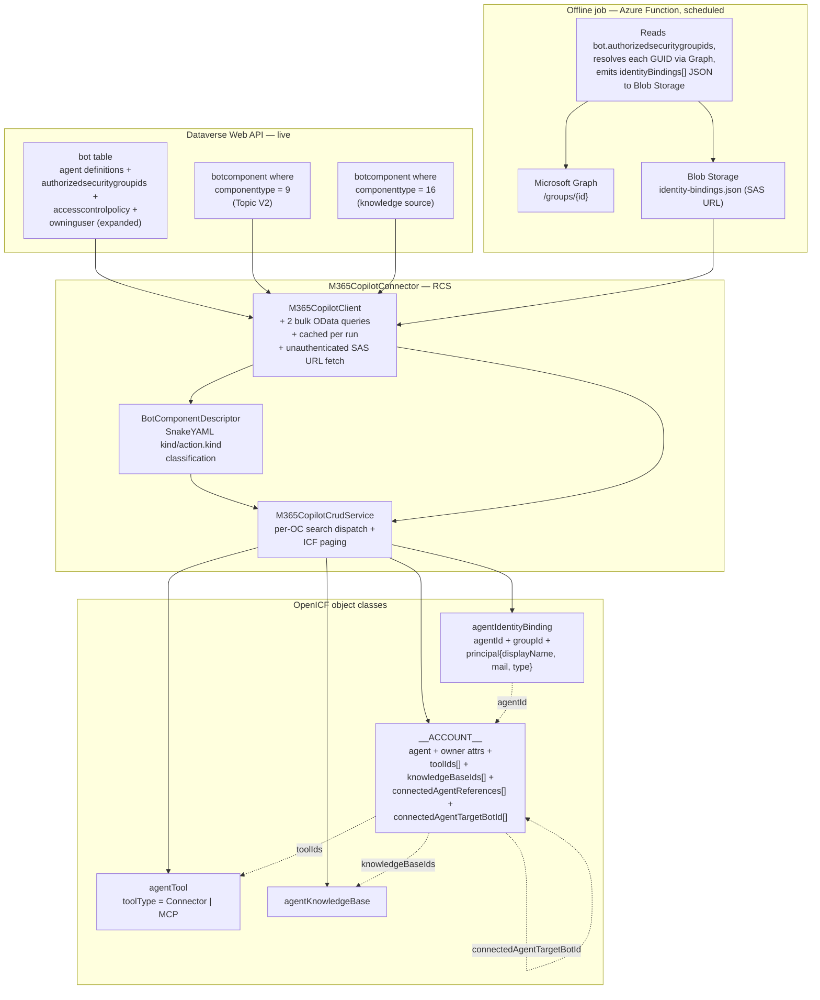

# Copilot Studio OpenICF Connector — Design Specification

_Version: 1.2 (post-deployment fixes complete)_
_Last updated: 2026-04-17_
_Target: PingOne IDM / OpenIDM via RCS_
_Customer: Intermountain Health — Identity Governance_

---

## 1. Executive Summary

The Copilot Studio connector is a read-only OpenICF connector that surfaces Microsoft Copilot Studio agent inventory into the Ping IGA platform. It answers four governance questions: **what agents exist**, **who owns each agent**, **what tools and knowledge sources each agent has access to**, and **which Azure AD security groups are authorized to interact with each agent**.

**Backend.** The connector targets the Dataverse Web API directly rather than the Microsoft Graph Package Management API. Graph requires delegated authentication with no application-permission path, which is incompatible with service-account reconciliation. Dataverse supports service principal authentication via client credentials and exposes the full Copilot Studio object model (`bot` and `botcomponent` tables) through OData.

**Object model.** Four ICF object classes are produced from two live queries against Dataverse plus one offline JSON feed:

| Object class | Cardinality | Source |
|---|---|---|
| `__ACCOUNT__` (Copilot agent) | one per published agent | `bot` entity + `owninguser` expansion |
| `agentTool` | one per tool | `botcomponent` type 9, discriminated by YAML `data` field |
| `agentKnowledgeBase` | one per knowledge source | `botcomponent` type 16 |
| `agentIdentityBinding` | one per (agent × AAD group) | offline JSON produced by a scheduled Azure Function |

**Why offline bindings.** The `authorizedsecuritygroupids` field on the `bot` entity is a raw list of AAD group GUIDs. Resolving those GUIDs to `displayName`, `mail`, and group type requires Microsoft Graph, which is a separate token scope and a separate authorization model. That resolution is performed by a scheduled offline job that produces a JSON inventory file; the connector reads the file at reconciliation time. Keeping that resolution out of the connector avoids per-agent Graph calls on every reconciliation and keeps the connector's auth surface to a single token scope.

**Owner attributes.** Agent owner identity (`ownerPrincipalId`, `ownerDisplayName`, `ownerUserPrincipalName`, `ownerMail`) is sourced directly from Dataverse via `$expand=owninguser(...)` on the `/bots` query. No Graph call is required — the Dataverse `systemuser` entity carries the AAD object ID (`azureactivedirectoryobjectid`) alongside the display name and email. `ownerPrincipalId` is the AAD object ID, not the Dataverse system user ID — these differ and the AAD object ID is the correct key for IGA correlation across systems.

**Scope.** Read-only — no Create, Update, Delete, or Sync. Reconciliation is full each run; there is no incremental delta. By default only published agents (those with a non-null `publishedon` field) are returned; unpublished draft agents are excluded unless `includeUnpublishedAgents=true`.

**Deployment.** Packaged as an OSGi connector bundle (`m365copilot-connector` v1.5.20.33), built for Java 17, deployed to the PingOne RCS via standard OpenICF bundle install.

---

## 2. Architecture



### 2.1 Relationship model

`__ACCOUNT__` is the anchor. Everything else is either a child of an agent or a principal authorized against one.

- **`toolIds`** (multi-valued on `__ACCOUNT__`) — `botcomponentid` values of type 9 components classified as tools (connector or MCP). The corresponding `agentTool` objects carry `agentId` pointing back to the parent bot.
- **`knowledgeBaseIds`** (multi-valued on `__ACCOUNT__`) — `botcomponentid` values of type 16 components. `agentKnowledgeBase` objects carry `agentId` back-pointer.
- **`connectedAgentReferences`** (multi-valued on `__ACCOUNT__`) — `schemaname` values of the local TaskDialog wrapper components classified as sub-agent references.
- **`connectedAgentTargetSchemaName`** (multi-valued on `__ACCOUNT__`) — raw `action.botSchemaName` values from the TaskDialog YAML, one per connected-agent wrapper. The schema name of the actual target bot.
- **`connectedAgentTargetBotId`** (multi-valued on `__ACCOUNT__`) — resolved botids corresponding to `connectedAgentTargetSchemaName`, looked up in-memory against the cached bot list. Entries are present only when the target bot exists in the same environment's cached list; unresolved references produce no entry rather than a null.
- **`agentIdentityBinding`** — each object ties one `agentId` to one `principal` (AAD group). The composite UID `{botid}:{groupId}` is the primary key.

### 2.2 Data flow per reconciliation

1. IDM initiates a search on one object class.
2. Connector (on first search in the run) issues **two bulk OData queries** against Dataverse: all bots (`/bots` with `$expand=owninguser`), all relevant botcomponents (`/botcomponents` filtered to type 9 or 16). Both are paginated via `@odata.nextLink` and fully accumulated.
3. Botcomponents are parsed into `BotComponentDescriptor` objects; each type 9 is classified by parsing its YAML `data` field with SnakeYAML and reading `kind` and `action.kind` via typed map access.
4. Both result sets are cached in `M365CopilotClient` for the connector instance lifetime.
5. For `__ACCOUNT__` searches, unpublished agents (null `publishedon`) are filtered out by default. Each passing bot's owner attributes are read from the embedded `owninguser` expansion. Relationship attributes are computed by filtering the cached component list by `_parentbotid_value`; connected-agent target botids are resolved via an in-memory `schemaname → botid` index built from the cached bot list.
6. For `agentIdentityBinding` searches (when `identityBindingScanEnabled=true`), the inventory JSON is fetched from the SAS URL using an unauthenticated GET (no Bearer token — SAS URLs are self-authenticating) and cached; each record in `identityBindings[]` becomes one ConnectorObject.
7. If `pageSize` is set in `OperationOptions`, the full candidate list is accumulated first, then sliced by `[offset, offset+pageSize)`. A `SearchResult` with the next offset cookie and remaining count is emitted via `SearchResultsHandler` if the handler implements it.

---

## 3. Backend: Power Platform / Dataverse

**Base URL:** `https://{environmentId}.crm.dynamics.com/api/data/v9.2`
**Token scope:** `https://{environmentId}.crm.dynamics.com/.default`
**Token endpoint:** `https://login.microsoftonline.com/{tenantId}/oauth2/v2.0/token`
**Grant type:** `client_credentials`

The service principal requires:
1. Azure AD app registration (no Azure-level API permissions needed for the connector).
2. Registration as a Power Platform admin application via the BAP API (one-time per tenant).
3. Addition as a Dataverse application user with the System Administrator security role in each target environment, performed via the Power Platform Admin Center.

No Microsoft Graph permissions are required by the connector. The `owninguser` expansion is a Dataverse-internal join against the `systemuser` table and does not require Graph access.

---

## 4. Object Class Model

Four object classes are defined, following the M365 Copilot connector naming conventions exactly.

| Object Class | OC Value | Dataverse Source | Cardinality |
|---|---|---|---|
| Copilot Agent | `__ACCOUNT__` | `bot` entity + `owninguser` expansion | One per published agent (by default) |
| Agent Tool | `agentTool` | `botcomponent` where `componenttype=9` and YAML discriminator matches | One per tool |
| Knowledge Source | `agentKnowledgeBase` | `botcomponent` where `componenttype=16` | One per knowledge source |
| Identity Binding | `agentIdentityBinding` | Offline JSON produced by scheduled Azure Function | One per AAD group per agent |

Sub-agents (connected agents) are **not** a separate object class — they appear as multi-valued attributes on `__ACCOUNT__`.

---

## 5. Tool Classification Logic

Dataverse does not use a distinct `componenttype` for tools. Type 9 (Topic V2) is shared across conversation topics, connector tools, MCP tools, and sub-agent references. Classification requires parsing the YAML `data` field of each type 9 record.

**Discriminator:**

| `data.kind` | `data.action.kind` | Classification |
|---|---|---|
| `AdaptiveDialog` | — | Conversation topic — **skip** |
| `TaskDialog` | `InvokeConnectorTaskAction` | Power Platform connector tool → `agentTool`, `toolType=Connector` |
| `TaskDialog` | `InvokeExternalAgentTaskAction` | MCP server tool → `agentTool`, `toolType=MCP` |
| `TaskDialog` | `InvokeConnectedAgentTaskAction` | Sub-agent reference → `connectedAgentReferences` + target resolution attributes on `__ACCOUNT__` |
| `AgentDialog` | — | Child-agent-side declaration — classified as `UNKNOWN`, dropped. See §15. |

**Implementation.** The connector fetches the `data` field in the bulk botcomponent query (it is not returned by default and must be explicitly listed in `$select`). Classification is performed by `BotComponentDescriptor` using SnakeYAML's `SafeConstructor` to parse the YAML string into a typed `Map<String, Object>`, then reading `kind` and `action.kind` via direct map key access. This approach is unambiguous regardless of YAML key emission order — a production sample confirmed that `action.historyType.kind` appears two lines after `action.kind` and would silently misclassify under the prior line-scanner approach.

**SnakeYAML fallback.** If SnakeYAML fails to parse the YAML (e.g., due to unquoted special characters such as `@`), the connector falls back to a line-scanner that extracts `kind` and `action.kind` sufficient for classification. Attributes that require full map traversal (`connectionReference`, `operationId`, `modelDescription`, `botSchemaName`) are not available in the fallback path and are left null. The fallback produces a WARN log entry.

**Performance note.** The bulk botcomponent query is large when the `data` column is included — in a big environment this may be tens of megabytes. It is loaded once per connector instance lifetime and reused across searches; this is acceptable for a reconciliation-oriented connector where the instance is short-lived (one reconciliation per instance).

---

## 6. Schema

### 6.1 `__ACCOUNT__` (copilotAgent)

Populated from the `bot` entity with `$expand=owninguser`. By default only agents with a non-null `publishedon` are returned; set `includeUnpublishedAgents=true` to include drafts.

| Attribute | Type | Multi | Source | Notes |
|---|---|---|---|---|
| `__UID__` | String | N | `botid` | |
| `__NAME__` | String | N | `name` | |
| `platform` | String | N | hardcoded: `COPILOT_STUDIO` | |
| `agentId` | String | N | `botid` | UID mirror |
| `statecode` | Integer | N | `statecode` | 0=Active, 1=Inactive |
| `statuscode` | Integer | N | `statuscode` | |
| `accessControlPolicy` | String | N | `accesscontrolpolicy` OptionSet → label | `Any`, `Agent readers`, `Group membership`, `Any (multi-tenant)` |
| `authenticationMode` | String | N | `authenticationmode` | |
| `runtimeProvider` | String | N | `runtimeprovider` | |
| `language` | String | N | `language` | |
| `schemaName` | String | N | `schemaname` | |
| `publishedOn` | String | N | `publishedon` | ISO-8601; null for never-published agents |
| `createdOn` | String | N | `createdon` | ISO-8601 |
| `modifiedOn` | String | N | `modifiedon` | ISO-8601 |
| `contentModeration` | String | N | parsed from `configuration.aISettings.contentModeration` | |
| `generativeActionsEnabled` | Boolean | N | parsed from `configuration.settings.GenerativeActionsEnabled` | |
| `useModelKnowledge` | Boolean | N | parsed from `configuration.aISettings.useModelKnowledge` | |
| `ownerPrincipalId` | String | N | `owninguser.azureactivedirectoryobjectid` | AAD object ID; absent for SYSTEM-owned bots |
| `ownerDisplayName` | String | N | `owninguser.fullname` | |
| `ownerUserPrincipalName` | String | N | `owninguser.domainname` | Absent when empty (e.g. SYSTEM) |
| `ownerMail` | String | N | `owninguser.internalemailaddress` | Absent when empty (e.g. SYSTEM) |
| `toolIds` | String | Y | derived from child type 9 components | `botcomponentid` values |
| `knowledgeBaseIds` | String | Y | derived from child type 16 components | `botcomponentid` values |
| `connectedAgentReferences` | String | Y | derived from child type 9 `CONNECTED_AGENT` components | `schemaname` of the local TaskDialog wrapper component |
| `connectedAgentTargetSchemaName` | String | Y | derived from `action.botSchemaName` in YAML | Raw schema name of the target bot; one entry per connected-agent wrapper |
| `connectedAgentTargetBotId` | String | Y | resolved from `connectedAgentTargetSchemaName` via cached bot index | `botid` of the target bot; absent when resolution fails |

### 6.2 `agentTool`

Populated from type 9 botcomponents classified as tools.

| Attribute | Type | Multi | Source | Notes |
|---|---|---|---|---|
| `__UID__` | String | N | `botcomponentid` | |
| `__NAME__` | String | N | `name` | |
| `platform` | String | N | hardcoded: `COPILOT_STUDIO` | |
| `agentId` | String | N | `_parentbotid_value` | |
| `toolType` | String | N | derived from `action.kind` | `Connector` or `MCP` |
| `connectionReference` | String | N | YAML `connectionReference:` | |
| `operationId` | String | N | YAML `operationId:` (or `operationDetails.operationId:`) | |
| `description` | String | N | YAML `modelDescription:` | |
| `schemaName` | String | N | `schemaname` | |
| `createdOn` | String | N | `createdon` | |
| `modifiedOn` | String | N | `modifiedon` | |

### 6.3 `agentKnowledgeBase`

Populated from type 16 botcomponents.

| Attribute | Type | Multi | Source | Notes |
|---|---|---|---|---|
| `__UID__` | String | N | `botcomponentid` | |
| `__NAME__` | String | N | `name` | |
| `platform` | String | N | hardcoded: `COPILOT_STUDIO` | |
| `agentId` | String | N | `_parentbotid_value` | |
| `schemaName` | String | N | `schemaname` | |
| `description` | String | N | `description` | |
| `createdOn` | String | N | `createdon` | |
| `modifiedOn` | String | N | `modifiedon` | |

### 6.4 `agentIdentityBinding`

Populated from offline inventory JSON. Only produced when `identityBindingScanEnabled=true` and an inventory source is configured.

| Attribute | Type | Multi | Source | Notes |
|---|---|---|---|---|
| `__UID__` | String | N | `{agentId}:{groupId}` | Composite |
| `__NAME__` | String | N | same as UID | |
| `platform` | String | N | hardcoded: `COPILOT_STUDIO` | |
| `agentId` | String | N | inventory `agentId` | |
| `agentVersion` | String | N | hardcoded: `latest` | No version concept in Copilot Studio |
| `kind` | String | N | hardcoded: `GROUP` | All bindings are AAD group based |
| `principal` | String | N | JSON: `{groupId, displayName, mail, groupType}` | Serialized JSON string |
| `permissions` | String | Y | hardcoded: empty list | API exposes presence only, not permission level |
| `scope` | String | N | hardcoded: `ENVIRONMENT` | |
| `scopeResourceId` | String | N | `agentId` | |

---

## 7. Dataverse API Queries

All queries target `https://{environmentUrl}/api/data/v9.2`.

### 7.1 Bulk agent list

```
GET /bots
  ?$select=botid,name,statecode,statuscode,accesscontrolpolicy,authorizedsecuritygroupids,
           authenticationmode,runtimeprovider,language,schemaname,publishedon,
           createdon,modifiedon,configuration,_ownerid_value
  &$expand=owninguser($select=systemuserid,fullname,domainname,azureactivedirectoryobjectid,internalemailaddress)
  &$orderby=createdon asc
```

Paginated via `@odata.nextLink`. The `owninguser` expansion is a Dataverse-internal join requiring no additional permissions beyond System Administrator on the environment.

### 7.2 Bulk botcomponent list (tools + knowledge bases)

```
GET /botcomponents
  ?$select=botcomponentid,name,componenttype,data,_parentbotid_value,
           schemaname,description,createdon,modifiedon
  &$filter=componenttype eq 9 or componenttype eq 16
  &$orderby=_parentbotid_value asc,componenttype asc
```

Paginated via `@odata.nextLink`.

### 7.3 GET by UID (agent)

```
GET /bots({botid})
  ?$select=botid,name,statecode,statuscode,accesscontrolpolicy,authorizedsecuritygroupids,
           authenticationmode,runtimeprovider,language,schemaname,publishedon,
           createdon,modifiedon,configuration,_ownerid_value
  &$expand=owninguser($select=systemuserid,fullname,domainname,azureactivedirectoryobjectid,internalemailaddress)
```

### 7.4 GET by UID (botcomponent)

```
GET /botcomponents({botcomponentid})
  ?$select=botcomponentid,name,componenttype,data,_parentbotid_value,
           schemaname,description,createdon,modifiedon
```

### 7.5 Test connection

```
GET /bots?$top=1&$select=botid
```

### 7.6 OData pagination

All list queries follow `@odata.nextLink` from the response body. The connector accumulates all pages fully before returning results to the handler. Next-link URLs are opaque server-generated strings and are fetched verbatim without re-encoding.

---

## 8. Authentication

### 8.1 Connector — Dataverse token

**Grant type:** client credentials against `https://login.microsoftonline.com/{tenantId}/oauth2/v2.0/token`
**Scope:** `https://{environmentUrl}/.default`

```
POST https://login.microsoftonline.com/{tenantId}/oauth2/v2.0/token
Content-Type: application/x-www-form-urlencoded

grant_type=client_credentials
&client_id={clientId}
&client_secret={clientSecret}
&scope=https://{environmentUrl}/.default
```

**Token cache:** `volatile String cachedToken` + `volatile long tokenExpiresAt` inside `M365CopilotClient`, guarded by a monitor lock. Refresh occurs 60 seconds before expiry.

**Retry on throttling.** `M365CopilotClient.execute()` retries on HTTP 429, 503, and 504, honoring the `Retry-After` response header (delta-seconds format). Maximum 3 attempts total; per-wait cap 60 seconds; total bounded wait ≤120 seconds. On give-up, a `ConnectorException` is thrown.

### 8.2 Connector — Inventory JSON (SAS URL)

The inventory JSON blob is fetched with a plain unauthenticated GET — no `Authorization` header. The SAS signature in the query string is the authentication mechanism. Sending a Bearer token alongside a SAS signature causes Azure Blob Storage to return HTTP 400 `InvalidAuthenticationInfo`.

```
GET {toolsInventoryUrl}
Accept: application/json
(no Authorization header)
```

### 8.3 Offline job — Graph token

The offline Azure Function acquires a separate Graph token using its system-assigned managed identity. This token is **not** used by or available to the connector.

**Scope:** `https://graph.microsoft.com/.default`

The connector itself has no Graph permissions and makes no Graph calls.

---

## 9. Identity Binding — Offline Job

### 9.1 Why offline

Resolving `authorizedsecuritygroupids` GUIDs to group `displayName` / `mail` / `groupType` requires Microsoft Graph. Doing this at reconciliation time would add a second token scope to the connector, N Graph calls per bot, and potential rate-limit complications. The offline job performs this resolution on a schedule and writes an enriched JSON file that the connector reads.

### 9.2 Access control policy branching

| Policy | Label | Job action |
|---|---|---|
| 0 | Any | Skip — no bindings emitted |
| 1 | Agent readers (Dataverse record-level security) | Deferred — not currently resolved |
| 2 | Group membership | Resolve each GUID in `authorizedsecuritygroupids` via Graph — **primary IH case** |
| 3 | Any (multi-tenant) | Skip — no bindings emitted |

### 9.3 Inventory JSON schema

```json
{
  "generatedAt": "2026-04-17T04:00:00Z",
  "schemaVersion": "2.0",
  "environmentId": "org51451987",
  "environmentUrl": "https://org51451987.crm.dynamics.com",
  "agents": [
    {
      "botId": "{agentId}",
      "name": "CustomerServiceAgent",
      "ownerPrincipalId": "{aadObjectId}",
      "ownerDisplayName": "SANJAY RALLAPALLY",
      "ownerUserPrincipalName": "sanjay@example.com",
      "ownerMail": "sanjay@example.com",
      "ownerPrincipalType": "User",
      "connectionReferenceId": null,
      ...
    }
  ],
  "identityBindings": [
    {
      "id": "{agentId}:{groupId}",
      "agentId": "{agentId}",
      "agentName": "CustomerServiceAgent",
      "groupId": "{groupId}",
      "groupDisplayName": "IH-Copilot-CS-Users",
      "groupMail": "ih-copilot-cs-users@example.org",
      "groupType": "Security"
    }
  ]
}
```

**Note:** The `agents[]` array in the inventory is no longer read by the connector. Owner attributes are now sourced directly from the Dataverse `owninguser` expansion (OPENICF-5015). The `agents[]` array remains in the inventory schema for potential future use and for the offline job's own reference, but the connector reads only `identityBindings[]`.

The connector reads this file from `toolsInventoryUrl` (HTTPS SAS URL) or `toolsInventoryFilePath` (local, dev/test only). The parsed JSON is cached for the connector instance lifetime. Identity binding scan is off by default; set `identityBindingScanEnabled=true` to enable. If the flag is true but no inventory source is configured, a WARN is logged on each reconciliation and the OC returns empty.

---

## 10. Configuration Parameters

| Parameter | Required | Default | Description |
|---|---|---|---|
| `tenantId` | Y | — | Azure AD tenant GUID |
| `environmentUrl` | Y | — | Dataverse environment URL, e.g. `https://org51451987.crm.dynamics.com` |
| `clientId` | Y | — | Azure AD application (client) ID for OAuth2 client credentials |
| `clientSecret` | Y | — | `GuardedString`. Azure AD application client secret |
| `toolsInventoryUrl` | N | — | SAS URL to identity binding JSON in Azure Blob Storage. Fetched without Authorization header. |
| `toolsInventoryFilePath` | N | — | Local filesystem path to inventory JSON. Dev/test only |
| `identityBindingScanEnabled` | N | `false` | Enable `agentIdentityBinding` reconciliation. Requires inventory source to be configured. When false, inventory is never fetched regardless of URL configuration. |
| `includeUnpublishedAgents` | N | `false` | Include agents that have never been published (`publishedon` is null). Default false returns published agents only. |
| `httpTimeoutSeconds` | N | 30 | Timeout for outgoing HTTP requests |
| `logPayloads` | N | `false` | Log raw API responses. Dev/troubleshooting only |

---

## 11. Java Package Structure

```
org.forgerock.openicf.connectors.m365copilot
├── M365CopilotConnector.java          # @ConnectorClass — SearchOp, SchemaOp, TestOp, Connector (non-poolable)
└── M365CopilotConfiguration.java      # AbstractConfiguration, StatefulConfiguration

org.forgerock.openicf.connectors.m365copilot.client
├── M365CopilotClient.java             # HTTP, token cache, retry/Retry-After, OData paging, bulk query cache, unauthenticated inventory fetch
├── BotDescriptor.java                 # bot JSON → __ACCOUNT__ ConnectorObject; owner attrs from owninguser expansion; buildSchemaNameIndex()
├── BotComponentDescriptor.java        # botcomponent JSON → agentTool or agentKnowledgeBase; SnakeYAML + line-scanner fallback
├── CopilotIdentityBindingDescriptor.java   # inventory JSON → agentIdentityBinding
└── ODataPagedResponse.java            # value[] + @odata.nextLink wrapper

org.forgerock.openicf.connectors.m365copilot.operations
└── M365CopilotCrudService.java        # Per-OC search dispatch; UID-lookup vs full-search routing; ICF paging; inventory fetch gated on identityBindingScanEnabled

org.forgerock.openicf.connectors.m365copilot.utils
├── M365CopilotConstants.java          # OC names, attribute names, OptionSet values, YAML discriminators
├── M365CopilotFilterTranslator.java   # EqualsFilter on __UID__/__NAME__ → String UID; else null
└── TokenResponse.java                 # OAuth2 token response parser
```

---

## 12. Class Responsibilities

### 12.1 `M365CopilotConnector`

The OpenICF entry point. Implements `Connector`, `SchemaOp`, `TestOp`, and `SearchOp<String>`. On `init()` it constructs a `M365CopilotClient` and a `M365CopilotCrudService` and holds them for the connector instance lifetime. `dispose()` closes the HTTP client and nulls references.

`PoolableConnector` is deliberately **not** implemented. The connector holds bulk caches of Dataverse bots and botcomponents inside `M365CopilotClient`; those caches are correct to reuse within a single reconciliation (multiple `executeQuery` calls on different object classes read the same underlying data) but would serve stale data if the instance were pooled and reused across reconciliations. Dropping pooling means IDM creates a fresh connector instance per reconciliation and disposes it afterward — the cache lifetime matches the reconciliation lifetime, which is what the caches were always designed for.

Responsibilities are deliberately thin: it defines the schema (attribute-by-attribute for all four object classes, each attribute marked read-only via `setCreateable(false).setUpdateable(false)`), dispatches `executeQuery()` to the appropriate `M365CopilotCrudService` method based on the object class name, and delegates `test()` to the client. The filter translator is constructed per-call and is stateless.

### 12.2 `M365CopilotConfiguration`

The configuration surface. Extends `AbstractConfiguration` and implements `StatefulConfiguration` so IDM can cache a single instance per connector pool. Ten configuration properties are declared with `@ConfigurationProperty` annotations.

`validate()` checks that required fields are set: `tenantId`, `environmentUrl`, `clientId`, and `clientSecret` are all required (managed identity is not implemented and the property has been removed).

`release()` is a no-op because the configuration holds no live resources (the HTTP client and caches belong to `M365CopilotClient`, which has its own lifecycle under `dispose()`).

### 12.3 `M365CopilotClient`

The workhorse. Encapsulates all Dataverse HTTP traffic and owns three independent caches:

- **Token cache**: volatile `cachedToken` + `tokenExpiresAt`, guarded by `tokenLock`, refreshed 60 seconds before expiry.
- **Bulk query cache**: `cachedBots` (raw `JsonNode` list) and `cachedBotComponents` (parsed `BotComponentDescriptor` list), guarded by `cacheLock`. Loaded lazily on first access; persisted for the client lifetime.
- **Inventory cache**: `cachedInventory` JSON, loaded lazily on first identity binding search. Only populated when `identityBindingScanEnabled=true`.

Constructed with an Apache `CloseableHttpClient` configured from `httpTimeoutSeconds`. Exposes:

- `getAccessToken()` — returns cached token or acquires a new one via client credentials grant.
- `listAllBots()` / `listAllBotComponents()` — bulk OData queries with full `@odata.nextLink` pagination, cached. Bot query includes `$expand=owninguser`.
- `getBot(id)` / `getBotComponent(id)` — direct GETs bypassing cache. Bot GET also includes `$expand=owninguser`.
- `fetchInventoryJson()` — fetches from SAS URL using `executeGetUnauthenticated()` (no Authorization header) or reads from local file path.
- `testConnection()` — `GET /bots?$top=1&$select=botid` for `TestOp`.
- `close()` — closes the HTTP client.

Two internal GET paths exist: `sendWithDataverseHeaders()` sets Bearer token + OData headers for all Dataverse calls; `executeGetUnauthenticated()` sets only `Accept: application/json` for SAS URL fetches. Both delegate to the same `execute()` retry loop.

HTTP status codes are translated to ICF exception types: 401/403 → `InvalidCredentialException`, 404 → `UnknownUidException`, other non-2xx → `ConnectorException`. Transient errors (429, 503, 504) trigger a bounded retry loop honoring `Retry-After` (see §8). The `logPayloads` configuration toggles verbose request/response logging.

### 12.4 `BotDescriptor`

An immutable value object representing a single bot. Constructed via `BotDescriptor.fromJson(JsonNode)`, which reads flat fields from the Dataverse response, parses the embedded `configuration` JSON blob for AI settings, and reads owner attributes from the `owninguser` expansion node.

Owner attribute mapping: `azureactivedirectoryobjectid` → `ownerPrincipalId` (the AAD object ID, not the Dataverse system user ID), `fullname` → `ownerDisplayName`, `domainname` → `ownerUserPrincipalName`, `internalemailaddress` → `ownerMail`. Empty string values for `domainname` and `internalemailaddress` (as returned for SYSTEM-owned bots) are suppressed — only non-empty strings are emitted as attributes.

`accesscontrolpolicy` is an OptionSet integer; the descriptor maps it to a human label via a switch in `accessControlPolicyLabel()`.

`isPublished()` returns true when `publishedOn` is non-null. Used by the CRUD service to gate the `__ACCOUNT__` result set when `includeUnpublishedAgents=false`.

`buildSchemaNameIndex(List<JsonNode> botNodes)` is a static factory that builds a `Map<String, String>` of `schemaname → botid` from the raw bot node list. Called once per reconciliation by the CRUD service and passed into `toConnectorObject` for connected-agent target resolution.

`toConnectorObject(List<BotComponentDescriptor> allComponents, Map<String, String> botSchemaNameIndex)` produces the final `__ACCOUNT__` object. It emits owner attributes directly from instance fields, filters the component list by `_parentbotid_value` to derive relationship attributes, and resolves connected-agent target botids via the schema name index.

### 12.5 `BotComponentDescriptor`

The most logic-heavy descriptor. Represents one `botcomponent` row and carries its classification. The `ComponentKind` enum has six values: `TOOL_CONNECTOR`, `TOOL_MCP`, `CONNECTED_AGENT`, `KNOWLEDGE_SOURCE`, `TOPIC`, `UNKNOWN`.

Classification occurs in `fromJson()` and `getComponentKind()`:

- Type 16 → `KNOWLEDGE_SOURCE` immediately.
- Type 9 → parse the YAML `data` field with SnakeYAML `SafeConstructor`. Read top-level `kind` and nested `action.kind` via typed map access. If `kind: AdaptiveDialog` → `TOPIC` (skip). If `kind: TaskDialog` with `action.kind: InvokeConnectorTaskAction` → `TOOL_CONNECTOR`. Similar mapping for MCP and connected-agent. Any other `kind` value (including `AgentDialog`) → `UNKNOWN` (dropped).

If SnakeYAML throws (e.g. unquoted `@` or other special characters in embedded content), the parser falls back to a line-scanner that extracts `kind` and `action.kind` — sufficient for classification. Attributes that require full map access are left null in the fallback path.

Four primary static helpers implement YAML extraction:

- `parseYamlData(String, String)` — `SafeConstructor` load with line-scanner fallback; returns synthetic map on partial fallback, empty map on total failure.
- `stringVal(Map, String)` — top-level string lookup.
- `stringValNested(Map, String, String)` — reads a nested string value one level deep; used for both `action.kind` and `action.botSchemaName`.
- `resolveOperationId(Map)` — tries `operationId`, then `operationDetails.operationId`.

The field `targetBotSchemaName` holds the value of `action.botSchemaName` extracted during `fromJson()`. It is exposed via `getTargetBotSchemaName()` for use by `BotDescriptor.toConnectorObject`.

### 12.6 `CopilotIdentityBindingDescriptor`

A lightweight descriptor for entries in the offline inventory JSON. `fromInventoryJson(JsonNode)` iterates the `identityBindings[]` array and returns one descriptor per entry. `toConnectorObject()` builds the `agentIdentityBinding` object with the composite UID `{agentId}:{groupId}` and the serialized `principal` JSON string.

The `principal` field is emitted as a JSON string (containing `groupId`, `displayName`, `mail`, `groupType`) rather than structured attributes. This matches the Azure AI Foundry connector's convention and gives IDM a single opaque field to pass through to governance dashboards.

### 12.7 `ODataPagedResponse`

A two-field wrapper around `value[]` and `@odata.nextLink`. `fromJson(root)` extracts both fields, tolerating missing values. Exists solely to make `getAllPages()` in `M365CopilotClient` readable; it carries no logic of its own.

### 12.8 `M365CopilotCrudService`

The dispatcher that sits between the connector's `executeQuery()` and the descriptors. One pair of methods per object class (`searchAgents`, `searchTools`, `searchKnowledgeBases`, `searchIdentityBindings`), each with a UID-lookup branch and a full-scan branch.

The UID-lookup branch is triggered when the filter translator returned a non-null query string (meaning: the filter was a simple equality on `__UID__` or `__NAME__`). It fetches the single resource directly and validates classification match.

The full-scan branch builds a **candidate list** (filtered by classification, published state, etc.), then applies ICF paging if `pageSize` is set in `OperationOptions`. Paging uses a decimal integer cookie encoding the next offset. After streaming the page slice to the handler, `emitSearchResult()` calls `SearchResultsHandler.handleResult()` with the next cookie (null when exhausted) and remaining count. When `pageSize` is zero or unset, the full candidate list is streamed unchanged.

`identityBindingScanEnabled` gates `searchIdentityBindings` uniformly across both UID-lookup and full-scan paths — the inventory is **never** fetched when this flag is false. `includeUnpublishedAgents` gates `searchAgents` paths similarly. Owner attributes for `__ACCOUNT__` come from the Dataverse `owninguser` expansion and are available regardless of `identityBindingScanEnabled`.

### 12.9 `M365CopilotFilterTranslator`

A minimal `AbstractFilterTranslator<String>` that handles exactly one case: `EqualsFilter` on `__UID__` or `__NAME__` returns the string value; everything else (including `NOT` of an equals) returns null. The CRUD service interprets null as "full scan required". Non-UID filters are not pushed down to Dataverse — see Limitations.

### 12.10 `M365CopilotConstants`

String constants. OC names, attribute names, YAML discriminator strings, OptionSet integer values, Dataverse API path, token endpoint template. No logic. The class is `final` with a private constructor.

### 12.11 `TokenResponse`

An immutable two-field value object holding `accessToken` and `expiresInSeconds`, parsed from the OAuth2 response via `fromJson(JsonNode)`. Used only by `M365CopilotClient.acquireTokenViaClientCredentials()`.

---

## 13. Bundle Manifest

| Property | Value |
|---|---|
| `ConnectorBundle-Name` | `org.forgerock.openicf.connectors.m365copilot-connector` |
| `Bundle-SymbolicName` | `org.forgerock.openicf.connectors.m365copilot-connector` |
| `ConnectorBundle-FrameworkVersion` | `1.5` (literal string) |
| `Bundle-Version` | `1.5.20.33` |
| `ConnectorBundle-Version` | `1.5.20.33` |
| `Build-Jdk-Spec` | `17` |
| `Embed-Directory` | `lib` |
| `Embed-Transitive` | `false` |

**Embedded dependencies (compile scope):**
- `httpclient` (4.5.14)
- `httpcore` (4.4.16)
- `jackson-databind` / `jackson-core` / `jackson-annotations` (2.16.2)
- `snakeyaml` (2.2)
- `commons-logging`, `commons-codec`

`azure-identity` is **not** embedded — the connector uses only client credentials.

---

## 14. Operations Supported

| Operation | `__ACCOUNT__` | `agentTool` | `agentKnowledgeBase` | `agentIdentityBinding` |
|---|---|---|---|---|
| Search (all) | ✓ | ✓ | ✓ | ✓ |
| GET by UID | ✓ | ✓ | ✓ | ✓ |
| Paged search | ✓ | ✓ | ✓ | ✓ |
| Create | ✗ | ✗ | ✗ | ✗ |
| Update | ✗ | ✗ | ✗ | ✗ |
| Delete | ✗ | ✗ | ✗ | ✗ |
| Sync | ✗ | ✗ | ✗ | ✗ |

`TestOp`: `GET /bots?$top=1&$select=botid` to verify auth and connectivity.

---

## 15. Limitations

The connector ships with known scope restrictions and known gaps. These are explicit design choices or deferred items, not bugs — they are listed here so deployers can plan around them.

**Read-only.** No Create, Update, or Delete operations against any object class. Copilot Studio agent creation, group assignment, and tool binding must be performed in Power Platform / Copilot Studio maker portal; the connector only observes.

**No sync / no incremental reconciliation.** `SyncOp` is not implemented. Every reconciliation is a full scan of all bots and all botcomponents. A delta-token approach based on `modifiedon` is feasible but not implemented.

**Filter pushdown is limited to UID equality.** `M365CopilotFilterTranslator` only recognizes `EqualsFilter` on `__UID__` or `__NAME__`. Any other filter falls through to a full scan of cached data, with the filter applied by the ICF framework after the connector has returned the page. Tracked as OPENICF-5009 (Nice to Fix).

**Single Dataverse environment per connector instance.** `environmentUrl` points to exactly one environment. Deployers with multiple Power Platform environments must configure one connector instance per environment.

**`AgentDialog` components are dropped.** Type 9 botcomponents with `kind: AgentDialog` are classified as `UNKNOWN` and excluded from all object classes. Production samples show these are child-agent-side declarations — the mirror of the `InvokeConnectedAgentTaskAction` wrapper on the parent side. Whether to surface them requires an IH governance decision. Tracked as OPENICF-5012.

**Connected-agent target resolution may be incomplete.** `connectedAgentTargetBotId` is populated only when the target bot exists in the same environment's cached bot list. Cross-environment sub-agent references produce a `connectedAgentTargetSchemaName` entry but no `connectedAgentTargetBotId`.

**Identity bindings require an offline job.** The connector cannot produce `agentIdentityBinding` objects on its own — it depends on the scheduled Azure Function emitting the inventory JSON to Blob Storage. Identity binding scan is disabled by default (`identityBindingScanEnabled=false`). When enabled without a configured inventory source, a WARN is logged on each reconciliation and the OC returns empty. Operators should set up an independent alert on the age of the inventory file.

**Inventory URL must be a SAS URL.** The connector fetches the inventory blob without an Authorization header. Any auth model other than SAS (e.g. Entra ID bearer token, managed identity) will require code changes.

**Policy=1 (Dataverse record-level security) agents produce no bindings.** The offline job only resolves AAD groups for `accesscontrolpolicy=2`. Agents configured with `accesscontrolpolicy=1` are skipped entirely. If IH has or adopts such agents, their authorized principals will not appear in IGA.

**Policy=0 and policy=3 agents produce no bindings.** Agents with policy=0 (Any authenticated user) or policy=3 (Any multi-tenant) have no specific principal list to emit. The absence of bindings in IGA for these agents is semantically correct — it is not a data gap, it is a reflection of the access model.

**Permissions field is empty.** `agentIdentityBinding.permissions` is always an empty list. The Dataverse API for Copilot Studio bots exposes group-level authorization presence but not a permission bitmask.

**Full bulk load per reconciliation.** Because the connector does not implement `PoolableConnector`, IDM creates a fresh instance per reconciliation — each run pays the full bulk-load cost. For IH's current object volumes this is acceptable.

**No retry on Entra ID throttling.** The retry loop covers Dataverse endpoints only (429/503/504). A token acquisition failure due to Entra ID throttling fails the reconciliation outright.

**Owner attributes absent for SYSTEM-owned agents.** Agents owned by the Dataverse SYSTEM user have no AAD identity. `ownerPrincipalId`, `ownerUserPrincipalName`, and `ownerMail` are absent on those objects. `ownerDisplayName` is present and set to `"SYSTEM"`.

**Published-agent filter relies on `publishedon` being stable.** The connector treats a non-null `publishedon` as the signal for a published agent. Whether `publishedon` is cleared when an agent is explicitly unpublished was not confirmed against a known-previously-published-then-unpublished sample.

---

## 16. API Permissions Summary

### Connector service principal

| Resource | Permission type | Permission | Purpose |
|---|---|---|---|
| Dataverse environment | Dataverse role | System Administrator | Read `bot`, `botcomponent`, `systemuser` (via owninguser expansion) |
| Entra ID | None | — | App registration only; no Azure API permissions required |
| Microsoft Graph | None | — | Not used by connector |
| Azure Blob Storage | None | — | Inventory fetched via SAS URL; no RBAC role needed |

The service principal must additionally be registered as a Power Platform admin application (one-time per tenant via BAP API) before it can be added as a Dataverse application user.

### Offline inventory job (Azure Function managed identity)

| Resource | Permission type | Permission | Purpose |
|---|---|---|---|
| Dataverse environment | Dataverse role | System Administrator | Read `bot.authorizedsecuritygroupids`, `bot.accesscontrolpolicy` |
| Microsoft Graph | App role | `GroupMember.Read.All` | Resolve AAD group GUIDs to `displayName`, `mail`, `groupType` |
| Microsoft Graph | App role | `User.Read.All` | Optional — enrich owner `userPrincipalName` and `mail` (no longer used by connector; retained for inventory job completeness) |
| Azure Blob Storage | RBAC role | Storage Blob Data Contributor | Write inventory JSON to blob container |
| Azure Blob Storage | RBAC role | Storage Blob Data Reader | Read inventory JSON (grant to connector service principal if not using SAS) |

---

## 17. Open Items

| # | Item | Owner | Priority |
|---|---|---|---|
| 1 | Confirm System Administrator is the correct Dataverse security role for the service principal, or determine minimum required privileges | IH Power Platform Admin | High |
| 2 | Confirm `authorizedsecuritygroupids` is populated on IH production agents | IH Security / Copilot Studio admins | High |
| 3 | Offline job schedule cadence — hourly recommended; align with reconciliation schedule | IH IGA Team | Medium |
| 4 | Policy=1 (Dataverse record-level security) support — deferred; determine if any IH agents use this policy | IH Security | Low |
| 5 | SAS URL expiry management — SAS tokens expire; establish rotation procedure for `toolsInventoryUrl` | IH Azure | Medium |
| 6 | Monitoring for stale `identity-bindings.json` — alerting threshold on file age | IH IGA / Ops | Medium |
| 7 | OPENICF-5012: decide whether to surface `AgentDialog` components — child-agent-side declaration currently dropped as UNKNOWN | IH governance + Developer | Medium |
| 8 | OPENICF-5009: filter pushdown beyond UID equality — Nice to Fix, deferred | Developer | Low |
